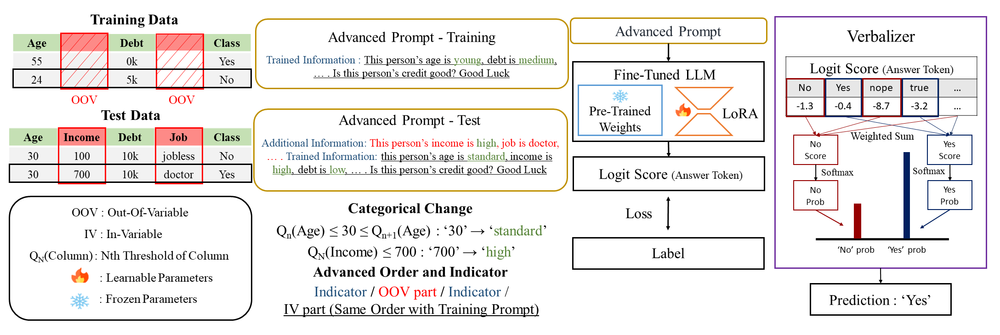

# Language-Based-Classifier for OOV Generalization

## Abstract

Large Language Models (LLMs) have performed well in many natural language process (NLP) tasks. Recently, LLMs have also been used to analyze tabular data. Although LLMs have had great success in natural language processing tasks such as text classification, their use in tabular data classification has been limited due to their inferior performance compared to traditional machine learning models (TMLs) such as XGBoost. However, LLMs have the potential for tabular data classification tasks because they consider the context between variables based on pre-trained knowledge. This implies that LLMs can interpret the context of data that is typically difficult to learn due to the large number of missing values in tabular data or new variables not seen in training. We refer to classification tasks in these situations as out-of-variable (OOV) tasks. We propose a methodology called Language-Based Classifier (LBC), which has the advantage of solving the OOV tasks in tabular data classification, which is distinct from TMLs. LBC’s strength in handling OOV tasks comes from its unique approach to tabular data classification. Firstly, the method of converting tabular data into natural language prompts allows LBC to seamlessly and intuitively handle OOVs for inference. Secondly, the interpretation of OOVs using LBC’s pre-trained knowledge base contributes to increasing the probability of the correct answer class. Building on these structural strengths, LBC employs three key methodological strategies: 1) Categorical Changes to adjust data to better fit the model’s understanding, 2) Advanced Order and Indicator to enhance data representation to the model, and 3) the use of a Verbalizer to map logit scores to classes during inference to generate model predictions. These strategies, combined with the inherent strengths of LBC, emphasize the model’s ability to effectively handle OOV tasks. We empirically and theoretically validate the superiority of LBC. LBC is the first study to apply an LLM-based model to OOV tasks.

*Figure 1: Overview of the Language-Based Classifier (LBC) methodology.*

This project includes code that is licensed under the MIT License by the following copyright holders:
Copyright (c) 2022 UWLeeLab Tuan Dinh Yuchen Zeng
